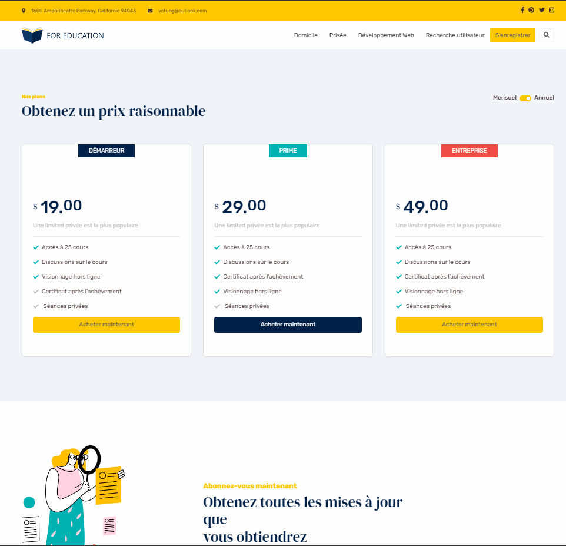
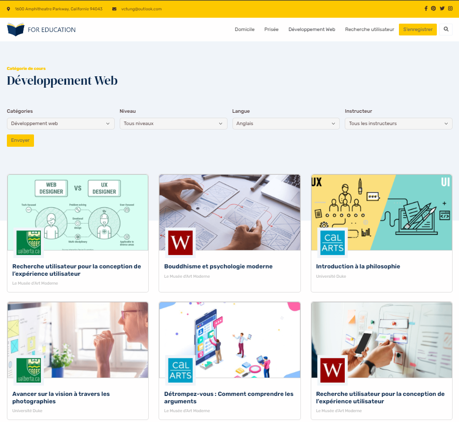
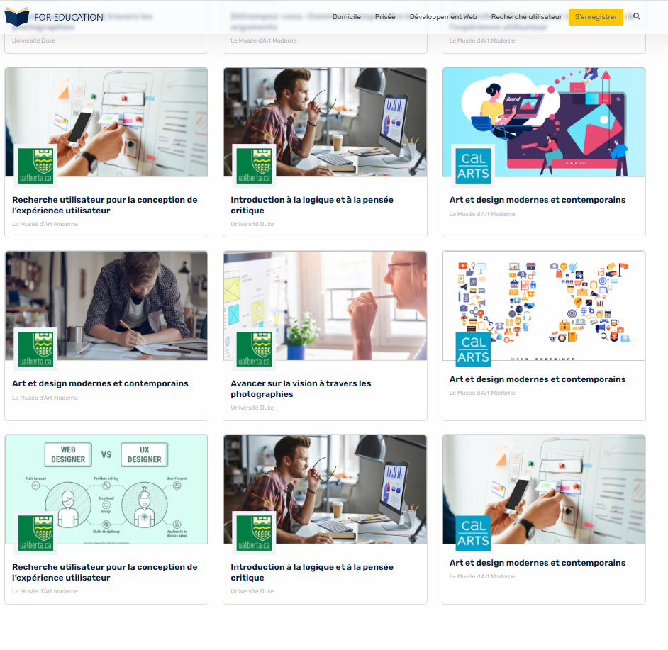
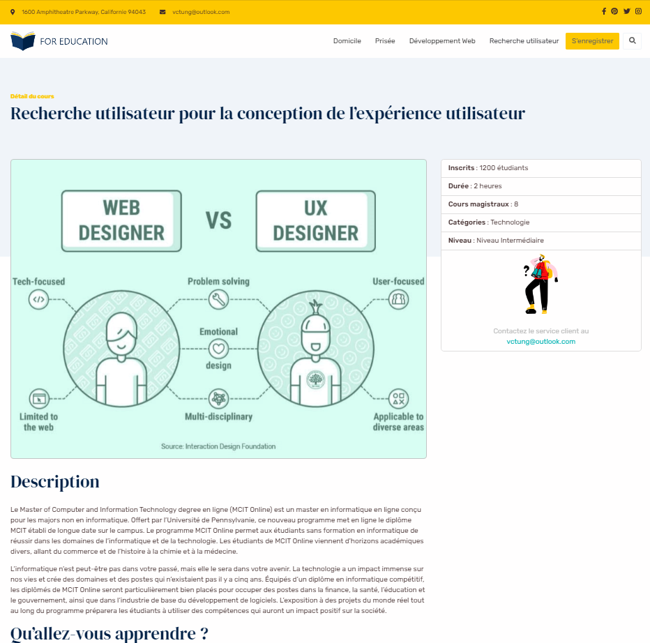
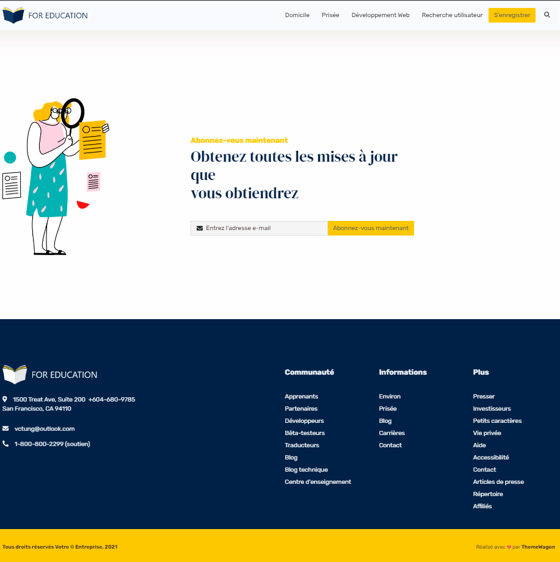

=============================      # DOCUMENTATION    ==========================

1-Architecture mi-hexagonal BackEnd fait avec Java Spring Boot;
2-Arcitecture micro service FrontEnd fait avec React JS;
3-BD fait avec pgAdmin;

